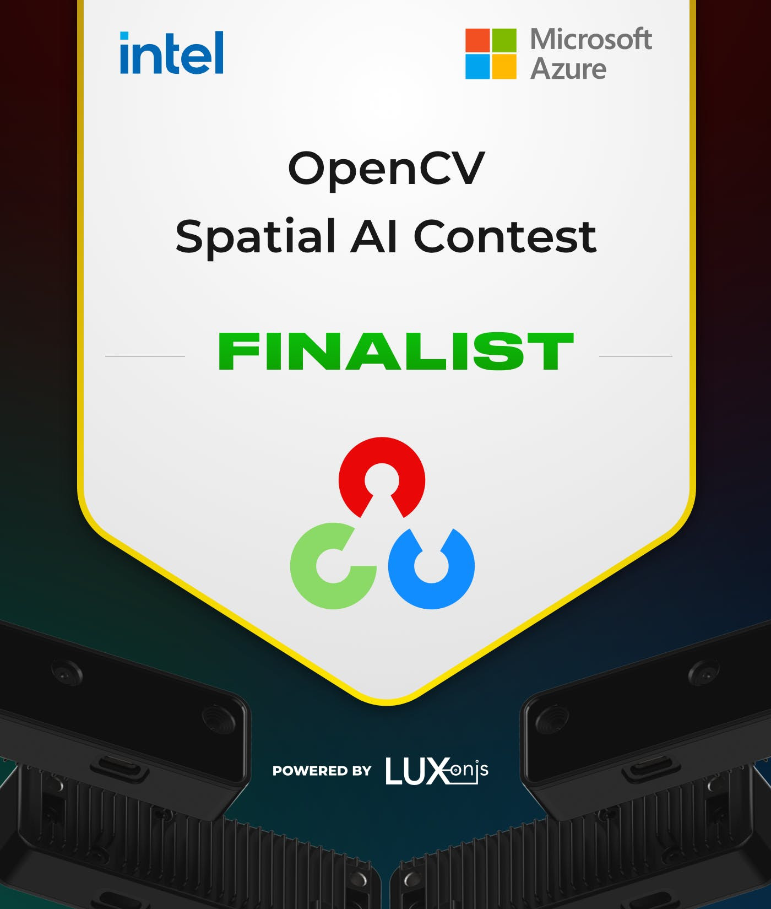

# Welcome to the B-AROL-O Team GitHub profile

<!--
Hi there 👋

**B-AROL-O/B-AROL-O** is a ✨ _special_ ✨ repository because its `README.md` (this file) appears on your GitHub profile.

Here are some ideas to get you started:

- 🔭 I’m currently working on ...
- 🌱 I’m currently learning ...
- 👯 I’m looking to collaborate on ...
- 🤔 I’m looking for help with ...
- 💬 Ask me about ...
- 📫 How to reach me: ...
- 😄 Pronouns: ...
- ⚡ Fun fact: ...
-->

The **B-AROL-O** Bottling System Team is proud to be

Stay tuned for our future announcements about the [ARNEIS](https://github.com/B-AROL-O/ARNEIS) project!

<!-- EOF -->
